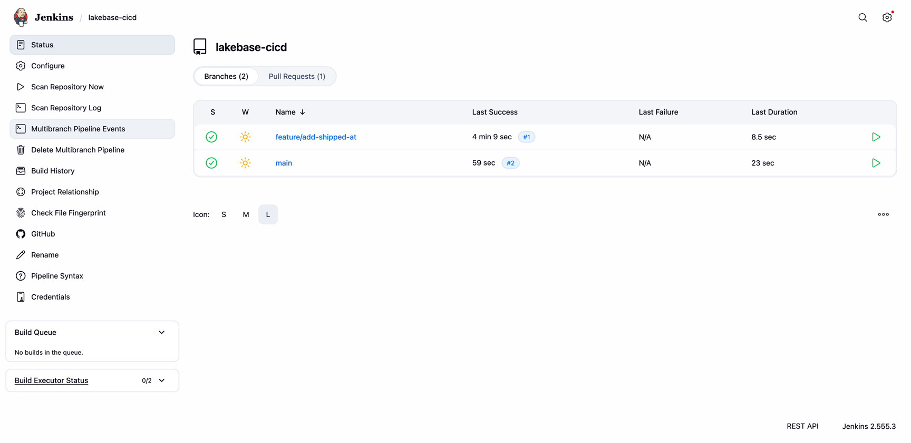
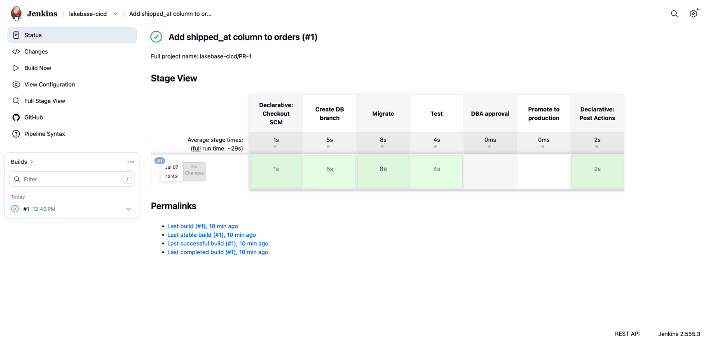
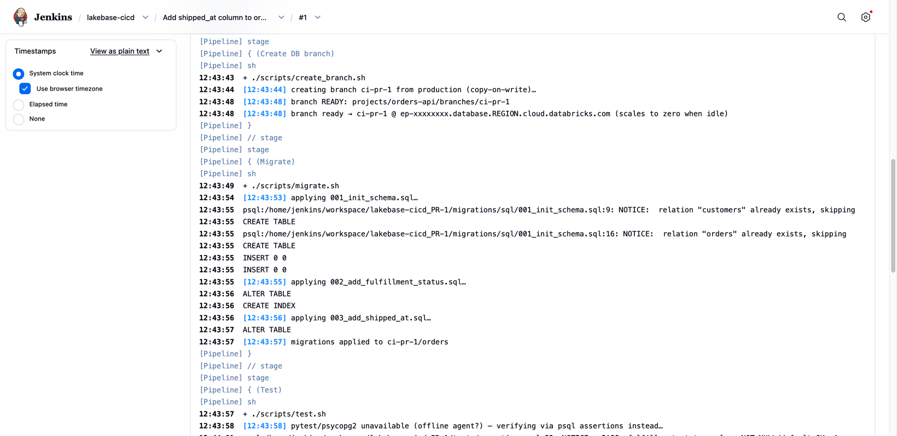
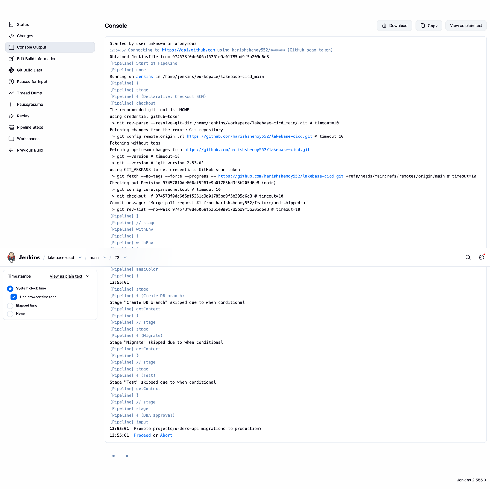
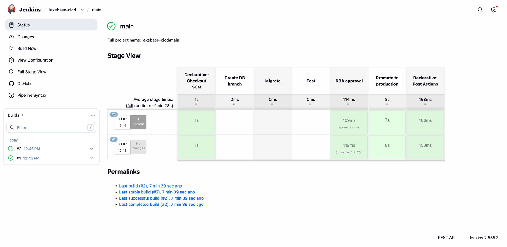

# Lakebase CI/CD — Git-style database branching on Jenkins

A complete, runnable reference implementation of database CI/CD on
[Databricks Lakebase](https://docs.databricks.com/) (managed PostgreSQL).

Open a pull request → a **real, data-inclusive database branch** is created
instantly (copy-on-write from production) → migrations are applied and tests run
against it → on merge, a **DBA-gated** stage promotes the same migration to
production → the branch is torn down. Developers and DBAs work in **one
pipeline**, on the **same migration artifact**, against the **same shape of data**.

> Companion blog post: *Git-Style Database CI/CD with Lakebase* — the "why," the
> architecture, and how this compares to Oracle, SQL Server, and Aurora.

---

## Why database branching changes CI/CD

In a traditional RDBMS a database is heavy: you can't cheaply make a full,
data-inclusive copy per branch, so teams share one dev database, test against
empty/stale schemas, and route changes through DBA ticket queues. Lakebase
separates storage from compute and makes a **branch a first-class object** —
instant copy-on-write clones of production, on endpoints that scale to zero when
idle. A database branch becomes as disposable as a Git branch.

```
Lakebase project: projects/orders-api
├── production        (protected)         ← DBA owns promotion
│   └── primary endpoint
└── ci-pr-42          (ephemeral)         ← one per pull request
    └── rw endpoint   (scale-to-zero)        copy-on-write from production,
                                             deleted on merge
```

---

## Repository layout

| Path | What it is |
|------|------------|
| `scripts/lib.sh` | Shared helpers: readiness waits, OAuth token + connection strings |
| `scripts/bootstrap_production.sh` | One-time: create project, DB, baseline schema + seed data |
| `scripts/create_branch.sh` | Create an ephemeral branch + read-write endpoint for a PR |
| `scripts/migrate.sh` | Apply migrations (plain SQL **or** Liquibase) to a branch |
| `scripts/test.sh` | Run `pytest` against the branch's database |
| `scripts/promote.sh` | Apply the reviewed migration to production |
| `scripts/teardown.sh` | Delete the ephemeral branch |
| `migrations/sql/*.sql` | Plain-SQL migrations (default path) |
| `liquibase/changelog/*.xml` | Optional Liquibase changelog (versioned, rollback-capable) |
| `tests/test_orders.py` | Tests that assert the migration is correct **against real rows** |
| `tests/assertions.sql` | Same assertions in pure SQL — the `psql`-only fallback for offline agents |
| `Jenkinsfile` | The pipeline that ties it together, with the DBA approval gate |

The Jenkinsfile is a thin orchestrator around `scripts/*.sh`, so **the exact
same commands run on your laptop and in CI**. That's what makes the try-out
below faithful to what Jenkins does.

---

## Prerequisites

- A Databricks workspace with **Lakebase (Autoscaling tier)** enabled.
- **Databricks CLI v0.285.0+** (`databricks postgres` commands). Check with
  `databricks --version`; upgrade with `brew upgrade databricks`.
- A configured CLI profile: `databricks auth login --host <workspace-url> --profile <name>`.
- `psql` (PostgreSQL 16 client), `jq`, `python3`.
- Optional: `liquibase` on your PATH if you want the Liquibase path.

---

## Try it out (local, ~3 minutes)

This runs the identical workflow Jenkins runs, straight from your shell.

```bash
git clone https://github.com/harishshenoy552/lakebase-cicd.git
cd lakebase-cicd

cp .env.example .env         # then edit: set DATABRICKS_PROFILE (and PROJECT if you like)
source .env

# 1. One-time: create the project + production branch, seed baseline data
./scripts/bootstrap_production.sh

# 2. Simulate a pull request: branch production instantly (copy-on-write)
BRANCH_ID=ci-pr-42 ./scripts/create_branch.sh

# 3. Apply the migration under test to the branch
BRANCH_ID=ci-pr-42 ./scripts/migrate.sh

# 4. Run the tests against the branch — real seeded rows, not an empty schema
#    (uses pytest if psycopg2/pytest are available, else psql-only SQL assertions)
BRANCH_ID=ci-pr-42 ./scripts/test.sh

# 5. "Merge": promote the same migration to production
./scripts/promote.sh

# 6. Tear the branch down — compute + copy-on-write storage reclaimed
BRANCH_ID=ci-pr-42 ./scripts/teardown.sh
```

Step 4 passes only because step 2 gave you a branch that **already contained the
production rows** — the tests assert those pre-existing orders were backfilled by
the `NOT NULL DEFAULT` migration. That's the assertion that quietly fails when
teams test against empty tables.

### Use Liquibase instead of plain SQL

```bash
export MIGRATION_TOOL=liquibase
BRANCH_ID=ci-pr-42 ./scripts/migrate.sh      # runs `liquibase update` against the branch
```

Liquibase adds versioned ordering, an applied-changeset audit trail
(`DATABASECHANGELOG`), and one-command `rollback`. Pick one path per project —
don't run both against the same database.

---

## Wire it into Jenkins

1. Add the Databricks CLI, `psql`, `jq`, and `python3` to your Jenkins agents.
2. Configure a **service principal** profile on the agent (the Jenkinsfile uses
   `DATABRICKS_PROFILE=jenkins-sp`). Lakebase issues short-lived OAuth tokens, so
   there's no static database password to store as a credential.
3. Point a **multibranch pipeline** at this repo. PR builds run
   create → migrate → test and tear the branch down in `post`; builds of `main`
   run the DBA-gated `input` approval, then promote.
4. Restrict the `DBA approval` stage submitter to your DBA group.

See [`Jenkinsfile`](./Jenkinsfile) for the full definition.

---

## See it run in Jenkins

The screenshots below are from a real run of this repo in a Jenkins multibranch
pipeline against a live Lakebase project. (Workspace paths and endpoint
hostnames are redacted.)

**1. Jenkins discovers your branches and the pull request.**



**2. The PR build runs the developer path** — checkout → create DB branch →
migrate → test — then tears the branch down. `DBA approval` and `Promote` are
skipped because it's a pull request.



**3. Inside that PR build:** an instant copy-on-write branch is created, the
migrations (incl. the PR's new one) are applied, and the tests run against the
branch's real, production-seeded data.



**4. On `main`, the pipeline pauses at the DBA approval gate** before touching
production. The DBA approves the exact migration that already passed CI.



**5. After approval, the promote stage applies the migration to production.**
On `main`, the create/migrate/test stages are skipped — only the gated promote runs.



---

## How this compares to Oracle / SQL Server / Aurora

| Capability | Oracle | SQL Server | Aurora | **Lakebase** |
|---|---|---|---|---|
| Per-PR data-inclusive copy | RMAN restore (hours) | Restore/copy (slow) | Fast clone (closest) | **Instant copy-on-write** |
| Idle cost of a test env | Full license + compute | Full license + compute | Billed while running | **Scales to zero** |
| Branch as a first-class object | No | No | Clones, not branches | **Yes** |
| Licensing tax on throwaway envs | Per-core (prohibitive) | Per-core/CAL | None, but compute adds up | **None, usage-based** |
| Native lakehouse integration | Separate stack | Separate stack | Separate stack | **Unity Catalog + Delta sync** |

The full argument is in the companion blog post.

---

## Cleanup

```bash
databricks postgres delete-project projects/orders-api -p "$DATABRICKS_PROFILE"
```

Deletes the project and every branch, endpoint, and byte of data under it.
